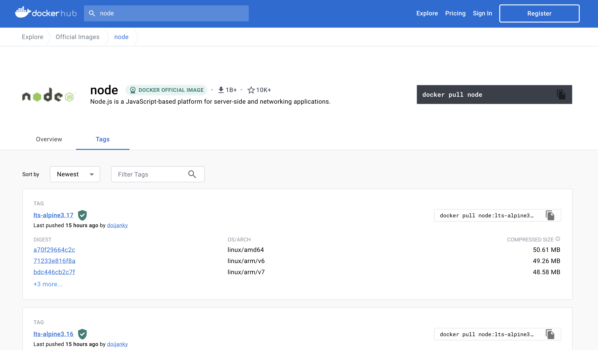

# Docker CLI

There is a graphical user interface which is handy for running and managing containers but personally I feel it better to use the docker command line interface. This helps familiarise one better with the various options and objects in Docker. Also, cloud providers like AWS, GCP and Azure wont typically provide graphical interfaces for linux boxes where you may want/need to run Docker.

The first command to run (and I'd say this for most cli's when wanting to become familiar with them) is;
```console
docker --help
```

As we can see from the output, there is **a lot** of information here. But, for the sake of this guide it's good to use it as a reminder for commands we'll look at.

## Running a Container

We're going to look at running [node](https://nodejs.org/en/) inside docker.

First we'll want to find the specific image that we're going to run. Go to [Docker Hub](https://hub.docker.com/), the most commonly used registry for storing images. Then search for [node](https://hub.docker.com/_/node) and press on the 'Tags' tab to show the different versions of the node image, sorted by release.



The specific version we're interested in is denoted with the tag `18.14.1-alpine`, the tag is used to infer the version and runtime environment of the image (alpine is a lightweight environment often chosen used due to its smaller size).

Let's pull down the image to our machine;
```console
docker pull node:18-alpine
```

Once completed, we can list our local images and see that it's there. You may see a different docker image at the top of your list, this is because images are listed by their created date not when they were pulled down.
```console
docker images
```

Great, so we have the image locally, let's run some simple JavaScript from inside the container.
```console
docker run node:18-alpine -e "console.log(process.env)"
```
*You could alternatively choose to run the image via its Image ID listed from the step above*

If you now list **all** your containers, you should see your node container which has successfully exited;
```console
docker ps -a
```
*`-a` is used to ensure we list all containers, without it we only list those which are currently running. Alternatively, we can use the command: `docker container ls -a` instead which is perhaps more familiar*

---

I got a little lazy here, and cut down the info ~ I may someday look to flesh this out but for the time being keeping this compact for the sake of my sleep...

To create an interactive node repl session:
```console
docker run -it node:18-alpine
```

To get more information on the image you can use and find out what's running:
```console
docker inspect node:18-alpine
```

To look at the entrypoint and interact in a shell session:
```console
docker run -it --entrypoint=sh node:18-alpine
```

Clean up containers:
```console
docker container prune
```

## Volumes

Pull down postgres alpine image:
```console
docker pull postgres:15-alpine
```

Let's inspect the image again:
```console
docker inspect postgres:15-alpine
```

Let's run the database:
```console
docker run --name pg-docker -e POSTGRES_PASSWORD=pass123 -e POSTGRES_USER=docker_user -e POSTGRES_DB=docker_demo postgres:15-alpine
```

It works! Let's run it in the background though, first close existing process (ctrl + c in terminal window).
Let's remove the container so we can free the name:
```console
docker rm pg-docker
```

Afterwards, run the image with the `-d` flat for detached mode.
```console
docker run --name pg-docker -e POSTGRES_PASSWORD=pass123 -e POSTGRES_USER=docker_user -e POSTGRES_DB=docker_demo -d postgres:15-alpine
```

Let's jump 'into' the container:
```console
docker exec -it pg-docker psql -U docker_user -d docker_demo
```

Let's create a table:
```sql
CREATE TABLE people (
  id serial primary key,
  name  varchar(255)
);
```

We can see the table has been created with:
```sql
\dt
```

Let's insert some sample records:
```sql
INSERT INTO people (name) VALUES ('tess'), ('roy'), ('charlie');
```

View the records in the table:
```sql
SELECT * FROM people;
```

Where is this data actually written?
Let's exit our postgres session (simply enter `exit`).

Like with images we can inspect containers too:
```console
docker inspect pg-docker
```

We can see the volume: `/var/lib/postgresql/data`
We can actually list all our docker volumes:
```console
docker volume ls
```

Let's stop our postgres container:
```console
docker stop pg-docker
```

You can also remove it:
```console
docker rm pg-docker
```

If we spin up another container:
```console
docker run --name pg-docker -e POSTGRES_PASSWORD=pass123 -e POSTGRES_USER=docker_user -e POSTGRES_DB=docker_demo -d postgres:15-alpine
```

In an interactive session we can see that our data doesn't exist:
```console
docker exec -it pg-docker psql -U docker_user -d docker_demo
```

That's no good, let's take down the new container again:
```console
docker stop pg-docker && docker rm pg-docker
```

Now we're going to use the original volume with our data to start the postgres container:
```console
docker run --name pg-docker -e POSTGRES_PASSWORD=pass123 -e POSTGRES_USER=docker_user -e POSTGRES_DB=docker_demo -d -v <your-docker-volume-name>:/var/lib/postgresql/data  postgres:15-alpine
```
*Unfortunately it's not possible to rename a docker volume, this is due the NAME being used to determine the local pathing to the data source ~ NAMES in Docker are actually more akin to ids. See this 2017 [issue](https://github.com/moby/moby/issues/31154) on this use case*

Creating an interactive session again, we can see that our original data is there!
```console
docker exec -it pg-docker psql -U docker_user -d docker_demo
```

Typically, it's best to create your volume first where we can give a more descriptive and user-friendly name:
```console
docker volume create my_data
```
